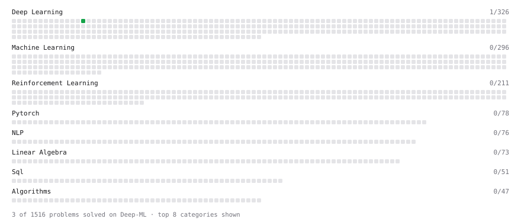

# Deep-ML

My machine learning practice from [Deep-ML](https://www.deep-ml.com). Every solution here was written by hand.

**2** solved · 2 problems · 0 labs · 0 math

[**Browse the interactive portfolio**](https://Krishnan9074.github.io/deep-ml/) to replay this filling in over time.

## Problems

| | Difficulty | Solved | |
| --- | --- | --- | --- |
| [KL Divergence Between Two Normal Distributions](https://www.deep-ml.com/problems/56) | easy | 2026-10-04 | [solution](problems/0056-kl-divergence-between-two-normal-distributions) |
| [Entropy & Cross-Entropy](https://www.deep-ml.com/problems/205) | medium | 2026-10-02 | [solution](problems/0205-entropy-cross-entropy) |

---

_This file is regenerated by Deep-ML on every push._
